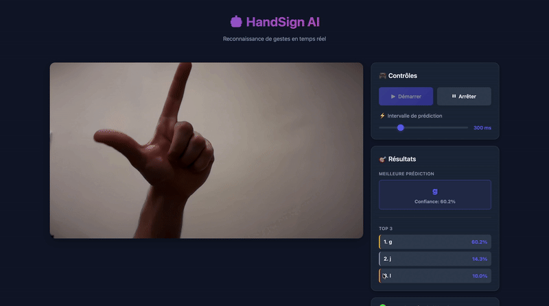

# Hand Sign Vision - ASL Recognition System

**Author:** Dylan MASTROLIA

## 📖 Introduction

This project is a real-time American Sign Language (ASL) hand sign recognition system. The goal is to accurately identify and classify the 26 letters of the ASL alphabet using computer vision and deep learning. The system captures live video from a webcam, processes each frame, and predicts the corresponding letter in real-time, making it a practical tool for learning and practicing ASL.

## 🎯 Project Overview

The system consists of three main parts:
- **Data Processing Pipeline**: Prepares and augments training data with various backgrounds and transformations
- **Custom CNN Model**: A lightweight neural network trained from scratch for fast inference
- **Web Application**: A FastAPI-based server with a real-time webcam interface for live predictions

## 📊 Dataset

### Source
The dataset was sourced from public repositories on Kaggle:
- [ASL Alphabet Test](https://www.kaggle.com/datasets/danrasband/asl-alphabet-test)
- [ASL(American Sign Language) Alphabet Dataset](https://www.kaggle.com/datasets/debashishsau/aslamerican-sign-language-aplhabet-dataset)
- [American Sign Language (ASL) Dataset](https://www.kaggle.com/datasets/prathumarikeri/american-sign-language-09az)
- [ASL Fingerspelling Images (RGB & Depth)](https://www.kaggle.com/datasets/mrgeislinger/asl-rgb-depth-fingerspelling-spelling-it-out)
- [Synthetic ASL Alphabet](https://www.kaggle.com/datasets/lexset/synthetic-asl-alphabet)
- [ASL Alphabet](https://www.kaggle.com/datasets/grassknoted/asl-alphabet)
- [American Sign Language Dataset](https://www.kaggle.com/datasets/ayuraj/asl-dataset)

### Dataset Statistics
- **Training Set**: 345,623 images
- **Evaluation Set**: 2,600 images
- **Classes**: 26 (A-Z letters of the ASL alphabet)
- **Image Size**: 224x224 pixels

### Data Augmentation

#### Background Removal and Replacement
To improve model robustness and generalization, I implemented a custom data augmentation pipeline:

1. **Background Removal** (`bg_remover.py`):
   - Uses the `rembg` library with U2Net model to remove backgrounds from hand sign images
   - Isolates the hand gesture from the original background
   - Converts images to PNG format with transparent backgrounds

2. **Random Background Addition** (`bg_adder.py`):
   - Takes background-removed images and composites them onto random background images
   - Randomly positions the hand gesture at different locations within an 800x800 canvas
   - Generates 5 variations per original image with different backgrounds and positions
   - This process significantly increases dataset diversity and helps the model focus on hand gestures rather than memorizing backgrounds

#### Training-Time Augmentation
During model training (see `ASL_trainer.ipynb`), I apply real-time data augmentation including:
- Random horizontal flips
- Random rotations (±5%)
- Random contrast adjustments (±10%)
- Random translations (±5%)
- Random zoom (±7%)
- Random brightness variations (±20%)
- Gaussian noise (σ=0.03)
- Random color inversion (50% probability)

These augmentations help the model generalize better and become robust to various lighting conditions, camera angles, and hand positions.

## 🏋️ Training

### Training Configuration
- **Hardware**: NVIDIA RTX 3090 GPU
- **Training Duration**: ~20 hours
- **Batch Size**: 128
- **Image Size**: 224x224 pixels
- **Optimizer**: AdamW (learning rate: 3e-4, weight decay: 1e-4)
- **Loss Function**: Sparse Categorical Crossentropy

### Model Architecture

I designed a custom lightweight CNN from scratch with the following characteristics:

```
Input (224x224x3)
  ↓
Rescaling (1/255)
  ↓
Data Augmentation Layer
  ↓
Conv Block (48 filters)
Conv Block (48 filters) → Conv Block (96 filters, stride=2)
Conv Block (96 filters) → Conv Block (192 filters, stride=2)
Conv Block (192 filters) → Conv Block (384 filters, stride=2)
  ↓
Global Average Pooling
  ↓
Dropout (0.4)
  ↓
Dense (26 classes, softmax)
```

**Conv Block structure:**
- 2D Convolution (3x3 kernel, same padding)
- Batch Normalization
- ReLU activation

### Design Philosophy

I chose to build a model from scratch rather than using transfer learning for several reasons:
- **Speed**: Smaller model size enables real-time inference on standard hardware
- **Efficiency**: Optimized specifically for the ASL recognition task
- **Learning Experience**: Full control over architecture and training process
- **Deployment**: Lightweight model suitable for edge devices and web applications

### Training Callbacks
- **ModelCheckpoint**: Saves the best model based on validation accuracy
- **ReduceLROnPlateau**: Reduces learning rate by 50% after 3 epochs without improvement
- **EarlyStopping**: Stops training after 8 epochs without improvement, restores best weights

## 🚀 Application

### Web Interface

The application is built with FastAPI and provides a real-time inference system (see `/app` directory):

**Components:**
- **Backend** (`server.py`): FastAPI server handling HTTP requests and model predictions
- **Model Wrapper** (`cnn_model.py`): Loads the trained model and provides inference methods
- **Frontend** (`templates/index.html`, `static/script.js`, `static/styles.css`): Web interface with live webcam feed

**Features:**
- Live webcam capture and processing
- Real-time predictions with adjustable inference interval (100-1000ms)
- Top-3 predictions display with confidence scores
- Modern, responsive UI with visual feedback
- No additional software required (runs in web browser)

### Running the Application

1. Install dependencies:
```bash
cd app
pip install -r requirements.txt
```

2. Start the server:
```bash
python server.py
```

3. Open your browser and navigate to `http://localhost:8000`

4. Click "Démarrer" to activate your webcam and start real-time predictions

## 🎬 Demo

Here's a demonstration of the system in action:



The demo shows real-time ASL letter recognition with live webcam feed, displaying top-3 predictions with confidence scores.

## ⚠️ Limitations

Through testing, I've identified several limitations:

1. **Similar Gestures Confusion**: The model sometimes struggles to differentiate between similar hand signs, particularly those involving a closed fist (e.g., A, E, M, N, S, T). These gestures have subtle differences that are challenging to capture in static images.

2. **Background Sensitivity**: While background augmentation helps, complex or busy backgrounds can still affect inference quality. For best results, I recommend using a plain white or uniform background.

3. **Lighting Conditions**: Extreme lighting conditions (too dark or too bright) can impact accuracy despite brightness augmentation during training.

4. **Hand Position and Distance**: The model performs best when the hand is centered in the frame and at a moderate distance from the camera.

## 🔧 Potential Improvements

Based on my experience with this project, here are several enhancements I would consider for future versions:

1. **"Nothing" Class**: Add a class for random/non-gesture images so the model can recognize when no sign is being shown. This would reduce false positives and make the system more practical.

2. **Additional Functional Gestures**: 
   - Add a "DELETE" gesture to remove the last character
   - Add a "SPACE" gesture to separate words
   - This would allow users to write complete sentences without manual intervention

3. **Expanded Vocabulary**: Include numbers (0-9) and common words/phrases in ASL


## 📄 License

GNU GENERAL PUBLIC LICENSE.

---

**Dylan MASTROLIA** - 2025

